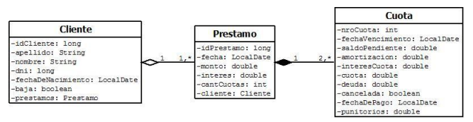

# Tarea para hacer

## Trabajo Práctico
Dar persistencia a las cuotas del préstamo según el siguiente Diagrama de Clases:





• Tener en cuenta que el cliente debe tener una lista de tipo Set de préstamos.

• Agregar un id en Cuota para manejarlo como PK a nivel BD.
• Agregar un atributo cancelado en la clase Prestamo, el mismo se encontrará en true si el préstamo
tiene todas sus cuotas pagas.

• En cuota el atributo cancelada cambiará a true cuando se paga la cuota. El atributo punitorios será
calculado por un interés por mora en el pago de la cuota que ingresará por parámetro, por ejemplo
2% mensual.

¿Cómo realizar la persistencia el objeto Prestamo y sus objetos Cuota?

Agregando en el mapeo ``Prestamo.hbm`` en la relación ``one-to-many`` la propiedad
``cascade=”save-update”`` cuando realizamos agregar(Prestamo p) de PrestamoABM Hibernate realiza el
insert del préstamo y el de todas las cuotas a pagar automáticamente.

En el caso de producirse un error en el insert de todos los objetos ocurrirá un rollback (devuelve la
base de datos al estado previo, por la sentencia tx.commit(); en el método agregar de PrestamoDao e
Hibernate levantará una excepción).

```
<set name="prestamos" cascade=”save-update table="prestamo" order-by="idPrestamo asc" inverse="true" lazy="true" fetch="select" >
    <key column="idCliente" not-null="true" />
    <one-to-many class="datos.Prestamo" />
</set>
```

En el caso de que un cliente venga a pagar una cuota se invocará al método traerCuota de
CuotaABM se se “setearán” los atributos: cancelada, fechaDePago, punitorios y por último modificarCuota
de CuotaABM.

Préstamos por Sistema Francés (cuota fija).
Un Préstamo bancario amortizado por el Sistema Francés que se pagará en 𝑛 cuotas, el sistema
deberá determinar el valor de cada cuota según el siguiente algoritmo:

Calculo de la 1° Cuota:
1. Entonces el primer 𝑠𝑎𝑙𝑑𝑜𝑃𝑒𝑛𝑑𝑖𝑒𝑛𝑡𝑒será el monto solicitado del crédito
2. Calculo de la amortizaron 𝑎𝑚𝑜𝑟𝑡𝑖𝑧𝑎𝑐𝑖𝑜𝑛 =
𝑠𝑎𝑙𝑑𝑜𝑃𝑒𝑛𝑑𝑖𝑒𝑛𝑡𝑒∗𝑖𝑛𝑡𝑒𝑟𝑒𝑠
(1+𝑖𝑛𝑡𝑒𝑟𝑒𝑠)
𝑛−1
3. Calculo del interés 𝑖𝑛𝑡𝑒𝑟𝑒𝑠𝐶𝑢𝑜𝑡𝑎 = 𝑠𝑎𝑙𝑑𝑜𝑃𝑒𝑛𝑑𝑖𝑒𝑛𝑡𝑒∗𝑖𝑛𝑡𝑒𝑟𝑒𝑠
4. Entonces el valor de la cuota será: 𝑐𝑢𝑜𝑡𝑎 = 𝑎𝑚𝑜𝑟𝑖𝑡𝑖𝑧𝑎𝑐𝑖𝑜𝑛 + 𝑖𝑛𝑡𝑒𝑟𝑒𝑠𝐶𝑢𝑜𝑡𝑎
5. Entonces la deuda pendiente será: 𝑑𝑒𝑢𝑑𝑎 = 𝑠𝑎𝑙𝑑𝑜𝑃𝑒𝑛𝑑𝑖𝑒𝑛𝑡𝑒 − 𝑎𝑚𝑜𝑟𝑡𝑖𝑧𝑎𝑐𝑖𝑜𝑛
6. Entonces el saldo pendiente será:𝑆𝑎𝑙𝑑𝑜𝑃𝑒𝑛𝑑𝑖𝑒𝑛𝑡𝑒 = 𝑆𝑎𝑙𝑑𝑜𝑃𝑒𝑛𝑑𝑖𝑒𝑛𝑡𝑒 − 𝑎𝑚𝑜𝑟𝑡𝑖𝑧𝑎𝑐𝑖𝑜𝑛


Calculo de la 2° Cuota:
1. Calculo de la amortizaron 𝑎𝑚𝑜𝑟𝑡𝑖𝑧𝑎𝑐𝑖𝑜𝑛 = 𝑠𝑎𝑙𝑑𝑜𝑃𝑒𝑛𝑑𝑖𝑒𝑛𝑡𝑒∗𝑖𝑛𝑡𝑒𝑟𝑒𝑠 (1+𝑖𝑛𝑡𝑒𝑟𝑒𝑠) (𝑛−1)−1
2. Calculo del interés 𝑖𝑛𝑡𝑒𝑟𝑒𝑠𝐶𝑢𝑜𝑡𝑎 = 𝑠𝑎𝑙𝑑𝑜𝑃𝑒𝑛𝑑𝑖𝑒𝑛𝑡𝑒∗𝑖𝑛𝑡𝑒𝑟𝑒𝑠
3. Entonces el valor de la cuota será: 𝑐𝑢𝑜𝑡𝑎 = 𝑎𝑚𝑜𝑟𝑖𝑡𝑖𝑧𝑎𝑐𝑖𝑜𝑛 + 𝑖𝑛𝑡𝑒𝑟𝑒𝑠𝐶𝑢𝑜𝑡𝑎
4. Entonces la deuda pendiente será: 𝑑𝑒𝑢𝑑𝑎 = 𝑠𝑎𝑙𝑑𝑜𝑃𝑒𝑛𝑑𝑖𝑒𝑛𝑡𝑒 − 𝑎𝑚𝑜𝑟𝑡𝑖𝑧𝑎𝑐𝑖𝑜𝑛
5. Entonces el saldo pendiente será:𝑆𝑎𝑙𝑑𝑜𝑃𝑒𝑛𝑑𝑖𝑒𝑛𝑡𝑒 = 𝑆𝑎𝑙𝑑𝑜𝑃𝑒𝑛𝑑𝑖𝑒𝑛𝑡𝑒 − 𝑎𝑚𝑜𝑟𝑡𝑖𝑧𝑎𝑐𝑖𝑜𝑛

Así sucesivamente hasta obtener la cuota enésima.

Fecha de Vencimiento de la Cuota:

• La fecha de vencimiento es mensual y la primera cuota vence al mes siguiente de la fecha de otorgamiento
del préstamo. Será siempre días hábiles que son todos los que no sean sábado, domingo o feriado nacional.
En el caso de ser el vencimiento un día feriado se pasará al siguiente día hábil.


